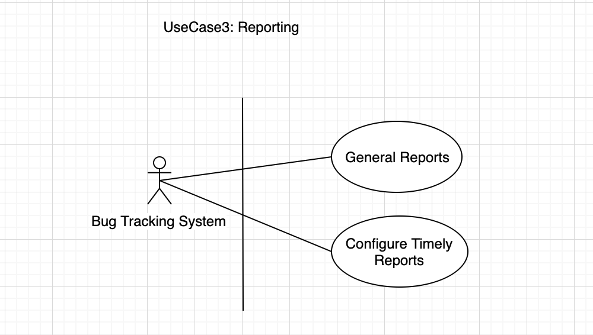

# Incident Management with Micro-Services Architecture.
## Reporting Service

     Fig. 1: Use Case For The Reporting Service.
      

* This service will handle generating bug report for the actors in the system.
* It will take an input of time range to generate the report automatically or manually.
* The report will only be generable by actors with the permission in the system.
* The report will be sent to the actor’s email address.
* The generated report details will be stored to the database.

## ROUGH BREAK DOWN OF ORM IMPLEMENTATION
* Definition
* Report
* Frequency
* Type

#### DEFINITION
<b>Attribute(s) Include:</b> id: int frequency: string type_id: int project_uuid: string roles: array user: array created_at: date updated_at: date next_execution_date: date  
<b>Method(s) Include:</b> calculateNextExecDate() 
#### REPORT
<b>Attribute(s) Include:</b> id: int def_id: int status: string attachment: file created_at: date updated_at: date  
<b>Method(s) Include:</b> generateReport() 
#### FREQUENCY
<b>Attribute(s) Include:</b> id: int name: string [one-time, daily, weekly & monthly] created_at: date updated_at: date  
<b>Method(s) Include:</b> ... 
#### TYPE
<b>Attribute(s) Include:</b> id: int name: string created_at: date updated_at: date  
<b>Method(s) Include:</b> generateReport() getBugInfo() getIssueInfo() 
